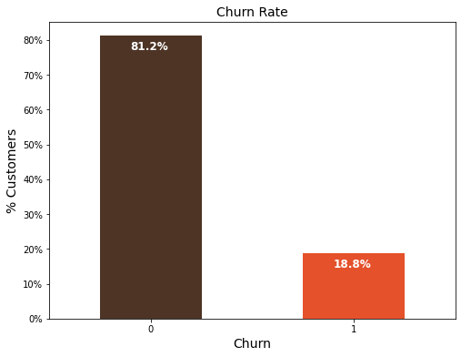
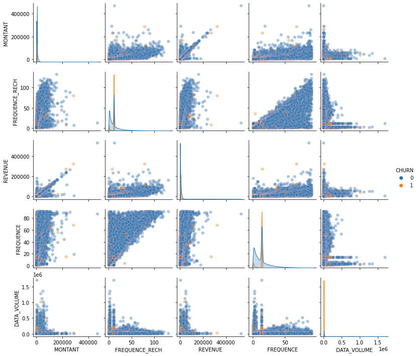
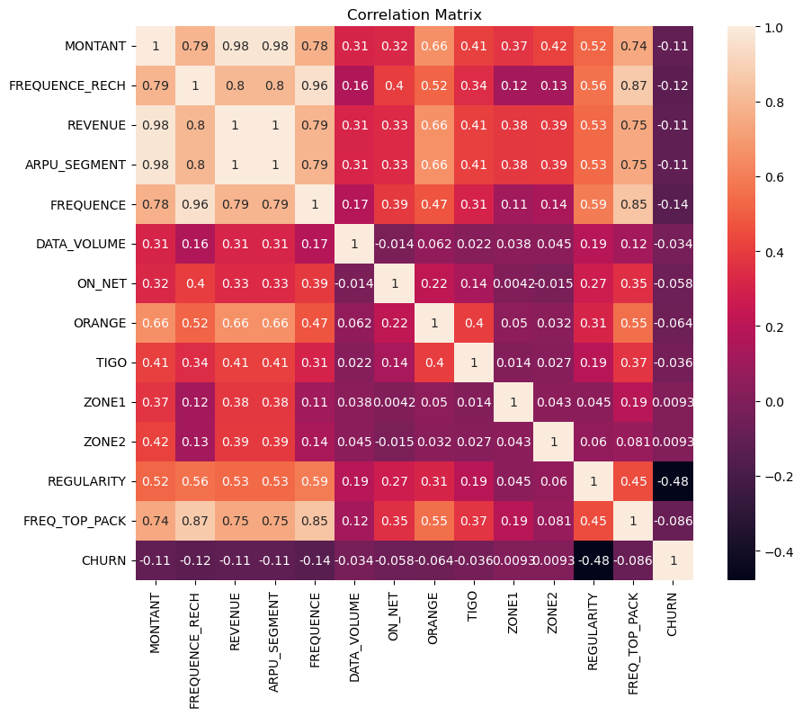

#  Expressor Customer Churn Prediction, ML Approach
<p align="center">
  
</p>

## Project Overview
In this project, we aim to find the likelihood of a customer leaving the organization, the key indicators of churn as well as the retention strategies that can be implemented to avert this problem.
Churn is a one of the biggest problem in the telecom industry. Research has shown that the average monthly churn rate among the top 4 wireless carriers in the US is 1.9% - 2%

Customer attrition is one of the biggest expenditures of any organization. Customer churn otherwise known as customer attrition or customer turnover is the percentage of customers that stopped using your company's product or service within a specified timeframe. For instance, if you began the year with 500 customers but later ended with 480 customers, the percentage of customers that left would be 4%. If we could figure out why a customer leaves and when they leave with reasonable accuracy, it would immensely help the organization to strategize their retention initiatives manifold.


<p align="center">
  
</p>


This solution will help this telecom company to better serve their customers by understanding which customers are at risk of leaving.


## The presentation follows the following outline

- [Project Overview](#project-overview)
- [Getting Started](#getting-started)
- [Data](#data)
- [Modeling](#modeling)
- [Evaluation](#evaluation)
- [Deployment](#deployment)


## Objectives

- Objective 1: Data Exploration
- Objective 2: Data Preprocessing
- Objective 3: Model Selection and Training
- Objective 4: Model Evaluation
- Objective 5: Results & Analysis
- Objective 6: Deployment and Future Improvements


## Summary
| Code | Name                                                | Summary of the work                                                                                          |                                                                                              Streamlit App    |                                                                                                |
|------|-----------------------------------------------------|------------------------------------------------------------------------------------------------------------|--------------------------------------------------------------------------------------------------------------|-------------------------------------------------------------------------------------------------------------|
| Capstone  | Expressor Customer Churn Prediction, ML Approach     | [Summary_PPT]() |  [Streamlit App](https://huggingface.co/spaces/HOLYBOY/Customer_Churn_App)      |


## Project Setup

To set up the project environment, follow these steps:

1. Clone the repository:

git clone my_github 

```bash 
https://github.com/FranAcheampong/Capstone_Churn_Prediction.git
```

2. Install the required dependencies:

```bash
pip install -r requirements.txt
```

3. Create a virtual environment:

- **Windows:**
  ```bash
  python -m venv venv
  venv\Scripts\activate
  ```

You can copy each command above and run them in your terminal to easily set up the project environment.


## Data

The data set used in this project was sourced from the [Zindi](https://zindi.africa/competitions/customer-churn-prediction-challenge-for-azubian).

## Data set Description

| Column Name     | Type   | Description                                                              |
|-----------------|-----------------|--------------------------------------------------------------------------|
| REGION          | Categorical     | The location of each client                                               |
| TENURE          | Numeric         | Duration with the network                                                 |
| MONTANT         | Numeric         | Top-Up Amount                                                             |
| FREQUENCE_RECH  | Numeric         | The number of times a customer refilled                                    |
| REVENUE         | Numeric         | Monthly income of each client                                             |
| ARPU_SEGMENT    | Numeric         | Income over 90 days divided by 3                                          |
| FREQUENCE       | Numeric         | Number of times the client has made an income                              |
| DATA_VOLUME     | Numeric         | Number of connections                                                     |
| ON_NET          | Numeric         | Inter Expresso call                                                       |
| ORANGE          | Numeric         | Calls to Orange                                                           |
| TIGO            | Numeric         | Calls to Tigo                                                             |
| ZONE1           | Numeric         | Calls to Zone1                                                            |
| ZONE2           | Numeric         | Calls to Zone2                                                            |
| MRG             | Categorical     | A client who is going                                                      |
| REGULARITY      | Numeric         | Number of times the client is active for 90 days                           |
| TOP_PACK        | Categorical     | The most active packs                                                     |
| FREQ_TOP_PACK   | Numeric         | Number of times the client has activated the top pack packages             |
| CHURN           | Binary          | Target variable to predict - Churn (Positive: customer will churn, Negative: customer will not churn) |


## Exploratory Data Analysis

During the exploratory data analysis (EDA) phase, a comprehensive investigation of the churn dataset was conducted to gain insights through various types of analyses.

- **Univariate analysis:** A thorough examination of each variable individually was performed. Summary statistics such as mean, median, standard deviation, and quartiles were calculated to understand the central tendency and spread of the data.

<p align="center">
  
</p>

- **Bivariate analysis:** Relationships between pairs of variables were explored to identify patterns and potential predictor variables for sepsis classification.

<p align="center">
  
</p>

- **Multivariate analysis:** Relationships among multiple variables were examined simultaneously, allowing for a deeper understanding of their interactions and impact on sepsis.

<p align="center">
  
</p>

### Hypotheses:
1. Customers with longer tenure are less likely to churn than those with short tenure.

2. Customers with lesser income are likely to churn than those who have higher

These hypotheses, along with the results of the EDA, contribute to a deeper understanding of the dataset and provide valuable insights for further analysis and model development.

### Business Questions
1. What is the relation of the preditor class (Churn) to other variable
- Churn rate
- Churn vrs. Tenure
2. What type of services offered by the telecom industry (Expressor)

3. What is the average tenure of customers?

## Modeling

During the modeling phase, the evaluation of models took into consideration the imbalanced nature of the data. The best performance evaluation estimator would be the AUC score, which provide a balanced assessment for imbalanced datasets.

We trained the underlisted six models and evaluated their performance based on Area Under the Curve (AUC)

- **Logistic Regression** 
- **Decision Tree** 
- **Random Forest** 
- **GaussianNB**
- **ComplementNB**
- **Support Vector Machine (SVM)**

These models were evaluated based on their AUC and logloss scores, providing insights into their performance on the imbalanced dataset. Below is the results;

<p align="center">
  
</p>

## Evaluation

<p align="center">
  
</p>


Given the imbalanced nature of our dataset, we assessed the models' performance using the AUC metric.

- Logistic Regression model emerged as th top-performing model, achieving the highest AUC scores of 80%.
- ComplementNB consistently demonstrated high performance across different conditions.
- GaussianNB had a relatively lower AUC score and higher log loss compared to other models.


### Streamlit deployment 

Navigate to the cloned repository and run the command:

```bash 
pip install -r requirements.txt
``` 
To run the demo app (being at the repository root), use the following command:
```bash 
streamlit run streamlitApp.py
```

### App Execution on Huggingface

Here's a step-by-step process on how to use the [Streamlit App](https://huggingface.co/spaces/HOLYBOY/Customer_Churn_App) on Huggingface:


<p align="center">
  
</p>

<p align="center">
  
</p>

<p align="center">
  
</p>

<p align="center">
  
</p>

## Contribution
You contribution, critism etc are welcome. We are willing to colaborate with any data analyst/scientist to improve this project. Thank your 

## Contact

`ACHEAMPONG Francis` 

`Data Analyst`
`Azubi Africa`

- [](https://www.linkedin.com/in/francis-acheampong) 
